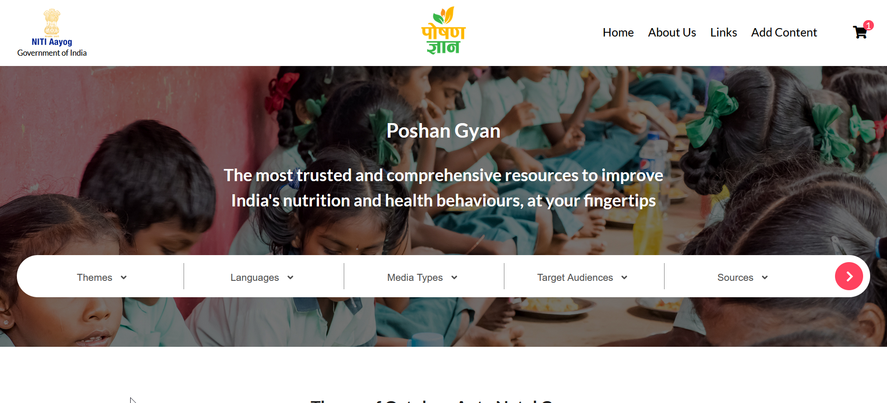
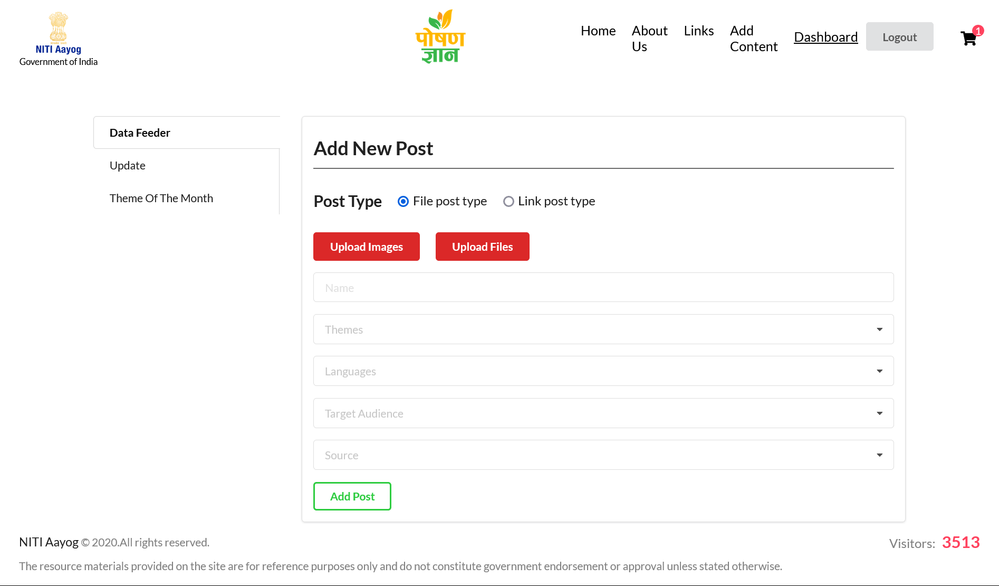
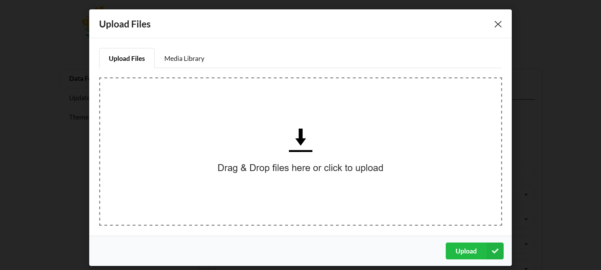
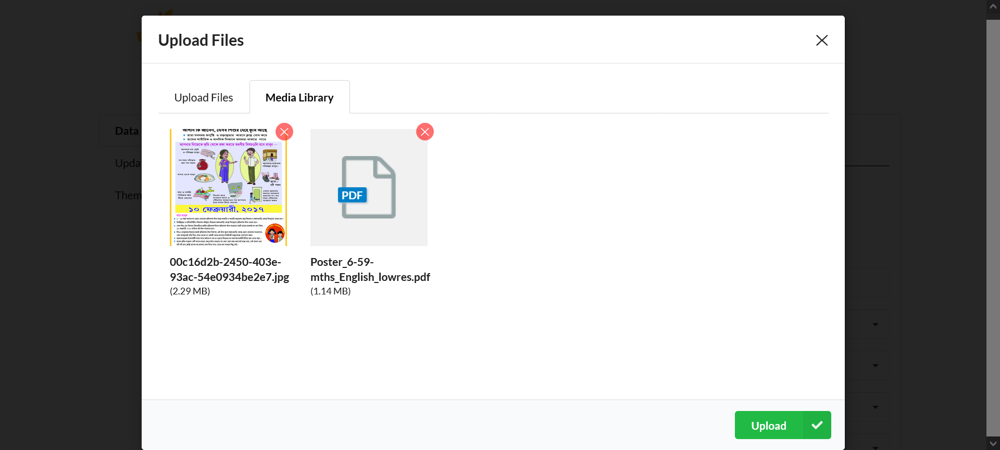
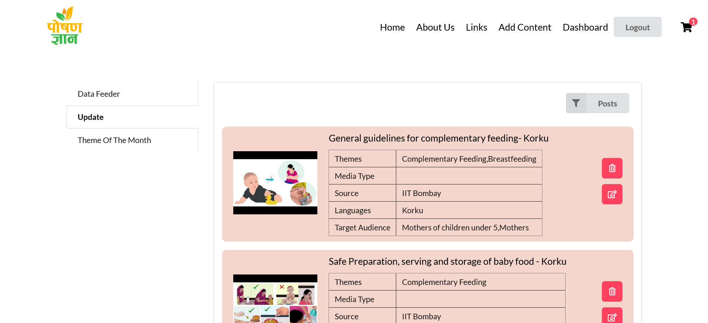
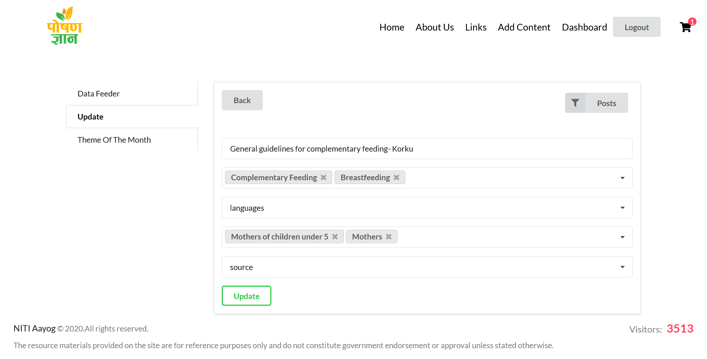
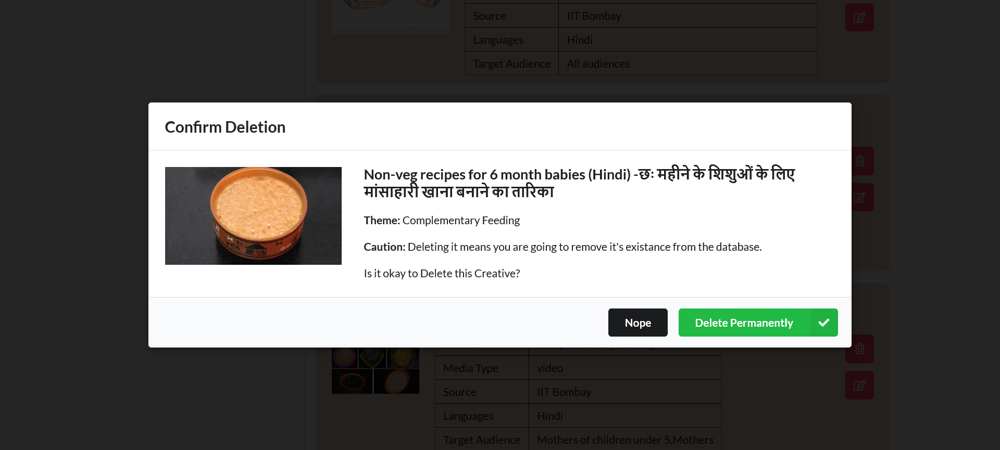
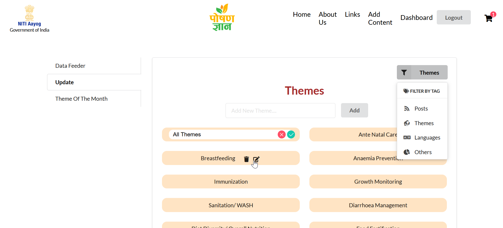
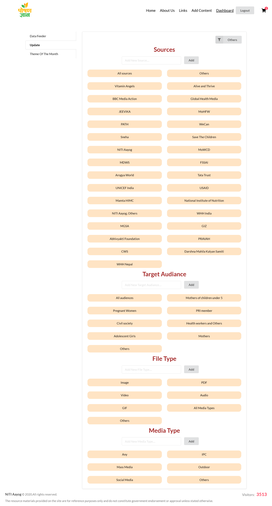
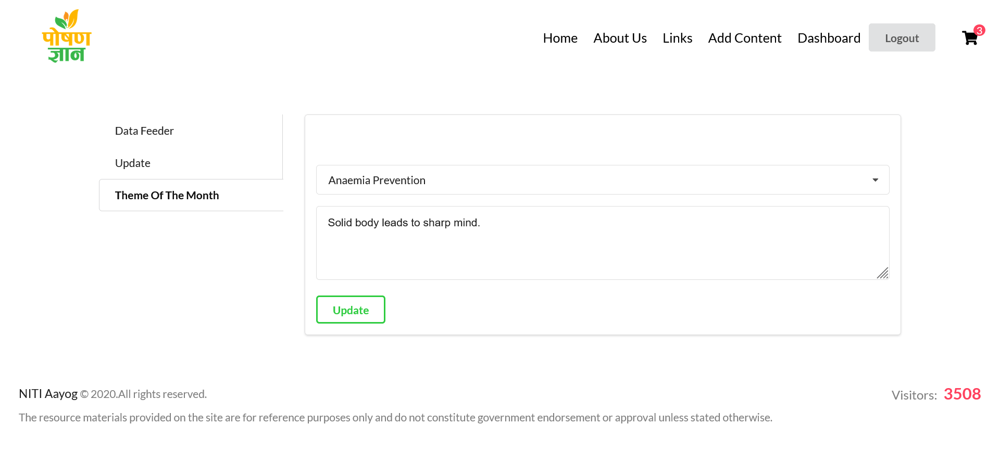

# <a href="https://manikdhanjal.com/projects/poshangyan" target="_blank">Poshangyan</a>

Demo link: <a href="https://manikdhanjal.com/projects/poshangyan" target="_blank">https://manikdhanjal.com/projects/poshangyan</a>

Poshan Gyan is designed to be accessible for everybody to use - whether frontline health workers, community leaders, teachers or anyone else seeking to improve nutritional outcomes. 

It contains materials targeted towards different audiences using a variety of media types. The 'search' toolbar on the homepage will help you find the most relevant materials for your purpose in a simple and easy manner.
d
### Tech Stack
- Front-End - React + Context API
- Back-End - Node.js, Express.js, MongoDB & AWS S3

## Setup

To run it locally -

### Steps to run in development mode:-

0. Create AWS account and create a bucket in AWS S3 and gather AWS credentinals like access ID, access key, bucket name, region.
1. Fork the repo and clone it.
2. Switch to `development` branch for running in development mode.
3. Make sure you have `npm` Node.js & MongoDB installed in your system.
4. [Only once] Run (from the root) `npm install` and `cd frontend && npm install`.
6. Start MongoDB service with `sudo service mongod start`. 
7. Define these env variables in poshangyan/.env file :- 

    | Envoirnment Variables |
    |-----------------------|
    |`NODE_ENV`|
    |`PG_MONGODB_URI`|
    |`PG_JWT_TOKEN`|
    |`PG_PORT`| 
    |`PG_EMAIL_USERNAME`|
    |`PG_EMAIL_PASSWORD`| 
    |`PG_EMAIL_CLIENT_ID`| 
    |`PG_EMAIL_CLIENT_SECRET`| 
    |`PG_EMAIL_REFRESH_TOKEN`|
    |`PG_AWS_ACCESS_KEY_ID`|
    |`PG_AWS_SECRET_ACCESS_KEY`|
    |`PG_AWS_REGION`| 
    |`PG_AWS_BUCKET_NAME`|
    |`PG_TWILIO_ACCOUNT_SID`| 
    |`PG_TWILIO_AUTH_TOKEN`|

8. go to root directory of project `cd ..` and execute `npm run dev` to start the backend and frontend. By default server will run on `port 8000` and frontend on `port 3000`.
9. Go to `http://localhost:3000` to see the application running.

### Steps to run in production mode :-

0. Follow step 0 to 7 as mentioned above.
1. run `cd frontend && npm run build` to create production ready build of react app or run `cd frontend && npm run aws-build` to make build with `/projects/poshangyan/` prefix URL.
2. now you can serve `frontend/build` as static HTML, CSS and JS files.
3. To run server, first go in root folder of project and execute `npm run server` or if you are using pm2 then `pm2 start backend/index.js`.
4. server will start running at `port 8000` if you haven't defined env `PG_PORT`.

## Dashboard Usage

login to dashboard using url `http://localhost:3000/2626/login` and default credentials
|||
|-------|----------------------|
| email | admin@poshangyan.com |
|password | admin@2022 |

### Steps to add contend :-

0. now you go to `Data Feeder` tab and select file type whether is it a embeded youtube video or media file.

    
1. To Upload files click on `Upload Files` and in `Upload Files` drag and drop files in dotted area.
    
2. preview Uploaded files open `Media Library` tab and click `Upload`.

    
3. Select categories of your content and click `Add Post`.

### Steps to modify/delete Content :-

0. Now go to `Update` tab in dashboard and select `Posts` in filter dropdown at top right.

    

1. EDIT: click on `edit icon` which leads to screen below where we can modify categories or title of a post.

    
2. DELETE: click on `trash icon` on left side of post to delete any post completely from database and AWS S3 then click `Delete Permanently` in prompt.

    
### Steps to modify/add/delete Categories :-

0. Now go to `Update` tab in dashboard and select category type `Themes`, ` Languages` or `Others` in filter dropdown at top right.

    

1. `Others` option in filter is consist of `Sources`, `Target Audience`, `File type` and `Media type`.

    

### Steps to change Theme of month :-

0. To Change Category Click on filter option on top right and select category type.

0. Select `Theme of The month tab` in dashboard, content related to theme of the month will appear below banner on homepage.

    

## Collaborators

This site is designed by [@manish-sharma](https://in.linkedin.com/in/manish-sharma-55b42670) and developed by [@manik-dhanjal](https://manikdhanjal.com) & [@anshah-sharma](https://github.com/anshajsharma) under [2626 Creative Studio](https://visit.2626.today) for [Niti Aayog](https://www.niti.gov.in/).